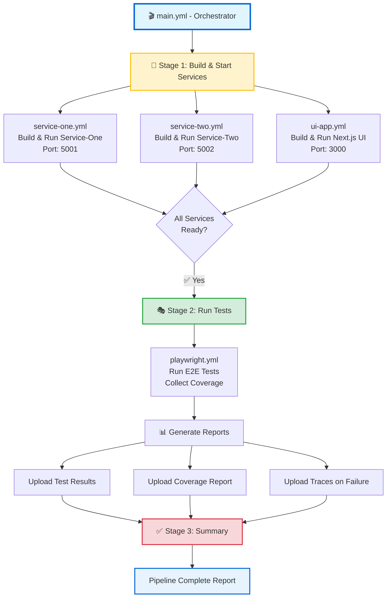

# GitHub Actions Workflow Architecture

## 🎨 Visual Pipeline Flow



## 🏗️ Reusable Workflow Pattern

Each workflow is modular and reusable:

```yaml
# Service workflows (service-one.yml, service-two.yml, ui-app.yml)
on:
  workflow_call:
    outputs:
      service-url: ...

# Playwright workflow (playwright.yml)
on:
  workflow_call:
    inputs:
      service-one-url: ...
      service-two-url: ...
      ui-url: ...
```

## 🔄 Data Flow Between Workflows

```
┌─────────────────┐
│ service-one.yml │ ──output──> service-url: http://localhost:5001
└─────────────────┘                   │
                                      ├─── inputs ───┐
┌─────────────────┐                   │              │
│ service-two.yml │ ──output──> service-url: http://localhost:5002
└─────────────────┘                   │              │
                                      ├─── inputs ───┤
┌─────────────────┐                   │              │
│   ui-app.yml    │ ──output──> app-url: http://localhost:3000
└─────────────────┘                   │              │
                                      │              ▼
                                      │      ┌───────────────┐
                                      └────> │ playwright.yml │
                                             └───────────────┘
```

## 📦 Artifact Storage

```
Playwright Tests Execution
         │
         ├─── Test Results (TRX format)
         │    └── Retention: 30 days
         │
         ├─── Coverage Report (HTML + Markdown)
         │    └── Retention: 30 days
         │
         └─── Playwright Traces (only on failure)
              └── Retention: 7 days
```

## 🎯 Execution Strategy

### Parallel Execution (Stage 1)
```
Service-One ──┐
Service-Two ──┤ Run simultaneously
UI App      ──┘ (save ~60% time)
```

### Sequential Execution (Stage 2)
```
Wait for all services ──> Run Playwright Tests
```

**Why?** Tests need all services to be running and healthy before execution.

## 🔐 Environment Variables & Secrets

```yaml
# In workflow files
env:
  ASPNETCORE_URLS: http://localhost:5001
  PORT: 3000

# For production (use GitHub Secrets)
env:
  API_KEY: ${{ secrets.API_KEY }}
  DATABASE_URL: ${{ secrets.DATABASE_URL }}
```

## 🧪 Test Coverage Pipeline

```
Run Tests with Coverlet
         │
         ├── Generate coverage.opencover.xml
         │
         ├── ReportGenerator processes XML
         │   ├── HTML Report (index.html)
         │   └── Markdown Summary (SummaryGithub.md)
         │
         ├── Upload as artifact
         │
         └── Add summary to PR comment
```

## 🚦 GitHub Actions UI Experience

### Actions Tab View
```
🎭 E2E Test Pipeline
├── 🔨 Service-One ✅
├── 🔨 Service-Two ✅
├── 🔨 UI ✅
└── 🎭 Playwright Tests ✅
    └── ✅ Pipeline Complete
```

### Pull Request View
```
✅ All checks have passed
├── 🎭 E2E Test Pipeline / Service-One (1m 23s)
├── 🎭 E2E Test Pipeline / Service-Two (1m 18s)
├── 🎭 E2E Test Pipeline / UI (1m 45s)
├── 🎭 E2E Test Pipeline / Playwright Tests (2m 34s)
└── 🎭 E2E Test Pipeline / Pipeline Complete (5s)

📊 Code Coverage: 85.7% (+2.3%)
```

## ⏱️ Estimated Execution Time

```
Parallel Stage 1: ~2 minutes (longest service build)
Sequential Stage 2: ~3 minutes (test execution)
Summary Stage: ~10 seconds

Total Pipeline Time: ~5-6 minutes
```

## 🎛️ Workflow Triggers

```yaml
on:
  push:
    branches: [main, develop]          # Auto-trigger on push
  
  pull_request:
    branches: [main, develop]          # Auto-trigger on PR
  
  workflow_dispatch:                   # Manual trigger button
```

## 🔄 Concurrency Control

```yaml
concurrency:
  group: ${{ github.workflow }}-${{ github.ref }}
  cancel-in-progress: true
```

**Effect:** If you push multiple commits quickly, only the latest run continues.

## 📝 Best Practices Implemented

✅ **Modularity:** Each service has its own workflow file  
✅ **Reusability:** `workflow_call` allows workflows to be called by other workflows  
✅ **Dependency Management:** `needs:` ensures proper execution order  
✅ **Parallel Execution:** Services build simultaneously for speed  
✅ **Health Checks:** Services are verified before tests run  
✅ **Artifact Retention:** Important results saved for 30 days  
✅ **Failure Handling:** Traces saved only on failure (saves storage)  
✅ **PR Integration:** Test results and coverage shown in PR  
✅ **Readable Summaries:** GitHub step summaries for quick insights  

## 🛠️ Customization Points

| What to Change | Where to Change | Example |
|----------------|----------------|---------|
| Service Port | service-*.yml → `ASPNETCORE_URLS` | `http://localhost:5001` |
| Browser Type | playwright.yml → appsettings.json | `"BrowserName": "firefox"` |
| Test Timeout | playwright.yml → job `timeout-minutes` | `timeout-minutes: 30` |
| Coverage Format | playwright.yml → `--collect` argument | `Format=cobertura` |
| Retention Days | playwright.yml → `retention-days` | `retention-days: 60` |
| Node Version | ui-app.yml → `node-version` | `node-version: '22'` |
| .NET Version | service-*.yml → `dotnet-version` | `dotnet-version: '10.0.x'` |

## 🔍 Debugging Failed Runs

### Service Build Failure
1. Check workflow logs for build errors
2. Verify dependencies are restored correctly
3. Check for port conflicts

### Service Health Check Timeout
1. Increase timeout in health check step
2. Verify service starts correctly locally
3. Check logs for startup errors

### Test Failures
1. Download `playwright-traces` artifact
2. Open with Playwright Trace Viewer: `npx playwright show-trace trace.zip`
3. Review screenshots and network requests

### Coverage Generation Failure
1. Verify Coverlet package is installed
2. Check TestResults directory contains coverage files
3. Verify ReportGenerator installation succeeded

## 📊 Monitoring & Observability

GitHub provides built-in metrics:
- **Workflow run duration**
- **Success/failure rates**
- **Step-by-step timing**
- **Resource usage (coming soon)**

Access via: **Insights** → **Actions** in your repository.
